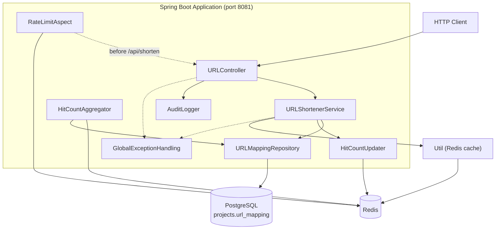
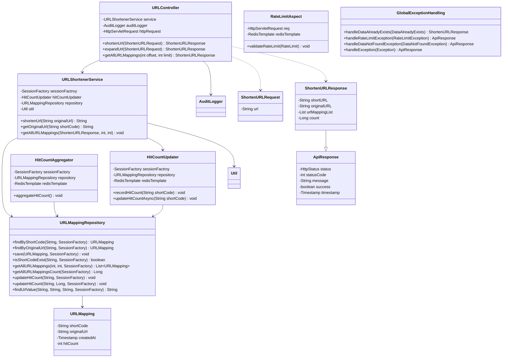
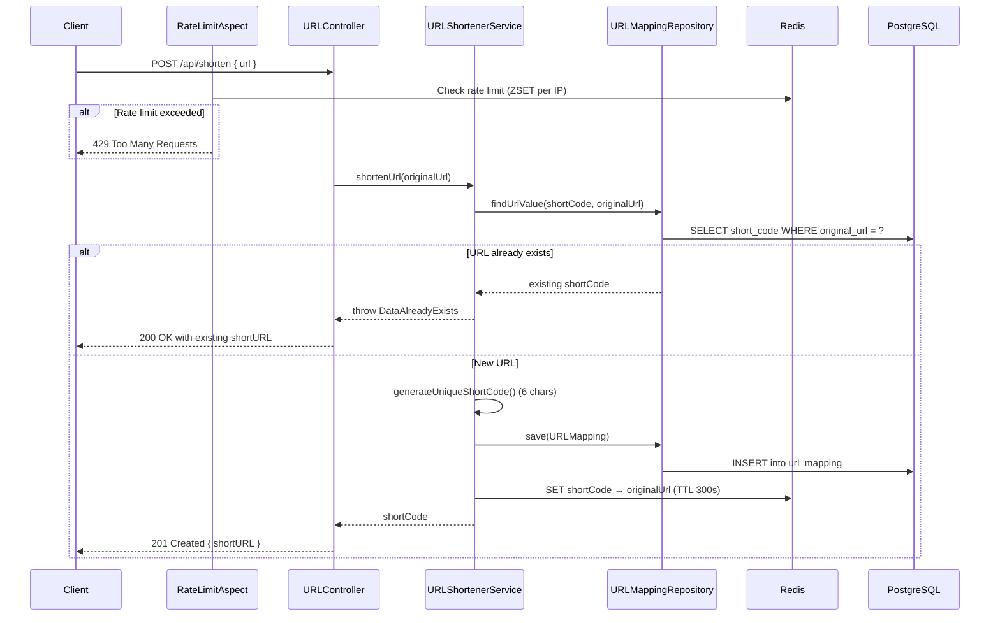
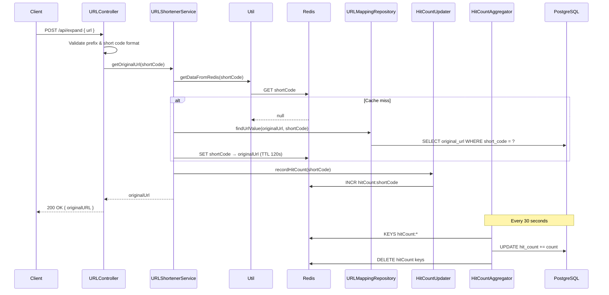
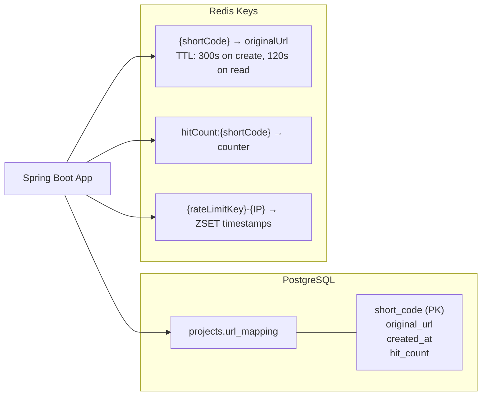

# URL Shortener

A REST API for shortening URLs, expanding short codes back to original URLs, and tracking access counts. The project is a **Spring Boot backend** backed by **PostgreSQL** and **Redis**.

> **Note:** The repository currently contains only the `backend/` module. There is no `frontend/` directory in this codebase.

## Features

- Shorten a long URL into a 6-character alphanumeric code prefixed with `http://devportal.com/`
- Return an existing short URL if the original URL was already shortened
- Expand a short URL back to its original URL
- Paginated listing of all URL mappings
- Hit count tracking via Redis buffering and periodic PostgreSQL aggregation
- Redis-backed URL lookup cache
- Per-IP rate limiting on the shorten endpoint (2 requests per 60 seconds)
- Centralized API response format with status, message, success flag, and timestamp
- Application and audit logging to file and console

## Tech Stack

| Layer | Technology |
|-------|------------|
| Runtime | Java 8 |
| Framework | Spring Boot 2.7.0 |
| Web | Spring Web (REST), WAR packaging |
| Persistence | Hibernate 5 (SessionFactory + Criteria API), PostgreSQL |
| Connection Pool | Apache Commons DBCP2 |
| Cache / Counters | Spring Data Redis |
| Cross-cutting | Spring AOP (rate limiting), Bean Validation |
| Logging | SLF4J + Logback (`logging.xml`) |
| Build | Maven |

## Project Structure

```
url-shortner/
├── backend/
│   ├── src/
│   │   ├── main/
│   │   │   ├── java/
│   │   │   │   ├── URLShortenerApplication.java      # App entry, beans (DataSource, SessionFactory, Redis)
│   │   │   │   ├── ServletInitializer.java           # WAR deployment support
│   │   │   │   └── com/devportal/
│   │   │   │       ├── annotation/                   # @RateLimit
│   │   │   │       ├── aspect/                       # RateLimitAspect
│   │   │   │       ├── async/                        # HitCountUpdater (Redis increment)
│   │   │   │       ├── bean/                         # URLMapping entity
│   │   │   │       ├── config/                       # LogDirectoryInitializer
│   │   │   │       ├── constants/                    # URLConstants
│   │   │   │       ├── controller/                   # URLController
│   │   │   │       ├── dao/                          # URLMappingRepository
│   │   │   │       ├── exceptions/                   # Custom exceptions + GlobalExceptionHandling
│   │   │   │       ├── scheduler/                    # HitCountAggregator (30s cron)
│   │   │   │       ├── service/                      # URLShortenerService
│   │   │   │       ├── to/
│   │   │   │       │   ├── request/                  # ShortenURLRequest
│   │   │   │       │   └── response/                 # ApiResponse, ShortenURLResponse
│   │   │   │       ├── util/                         # Util, AuditLogger
│   │   │   │       └── validation/                   # URLValidation
│   │   │   └── resources/
│   │   │       ├── application.properties
│   │   │       └── logging.xml
│   │   └── test/
│   │       └── java/com/devportal/
│   │           └── UrlShortenerApplicationTests.java
│   ├── logs/                                         # Runtime log output (application + audit)
│   ├── pom.xml
│   ├── mvnw / mvnw.cmd
│   └── .mvn/
└── README.md
```

## Architecture Overview

The application follows a layered REST architecture. HTTP requests enter through `URLController`, business logic lives in `URLShortenerService`, and data access is handled by `URLMappingRepository` using Hibernate's `SessionFactory`. Redis is used for three concerns: URL caching, hit-count buffering, and rate-limit tracking.



### Layer Responsibilities

| Layer | Class(es) | Responsibility |
|-------|-----------|----------------|
| Controller | `URLController` | REST endpoints, request validation, audit logging |
| Service | `URLShortenerService` | Short-code generation, cache/DB lookup, hit recording |
| Repository | `URLMappingRepository` | Hibernate Criteria/SQL queries against `url_mapping` |
| Entity | `URLMapping` | JPA entity mapped to `projects.url_mapping` |
| Async | `HitCountUpdater` | Increments Redis counter on each expand |
| Scheduler | `HitCountAggregator` | Flushes Redis hit counts to PostgreSQL every 30 seconds |
| AOP | `RateLimitAspect` | Sliding-window rate limit via Redis sorted sets |
| Exception | `GlobalExceptionHandling` | Maps exceptions to `ApiResponse` / `ShortenURLResponse` |

## UML Diagrams

### Class Diagram



### Sequence Diagram — Shorten URL



### Sequence Diagram — Expand URL



### Component Diagram — Data Stores



## Database Schema

Hibernate manages the schema via `spring.jpa.hibernate.ddl-auto=update`. The entity maps to the `projects` schema:

| Column | Type | Notes |
|--------|------|-------|
| `short_code` | `VARCHAR` (PK) | 6-character alphanumeric code |
| `original_url` | `VARCHAR` | Full original URL |
| `created_at` | `TIMESTAMP` | Creation time |
| `hit_count` | `INT` | Default `0`; updated by `HitCountAggregator` |

## API Endpoints

Base URL: `http://localhost:8081`

| Method | Endpoint | Description | Notes |
|--------|----------|-------------|-------|
| `POST` | `/api/shorten` | Create a short URL | Rate limited: 2 req / 60s per IP |
| `POST` | `/api/expand` | Resolve short URL to original | Validates `http://devportal.com/` prefix |
| `GET` | `/api/getAllURLMappings` | List all mappings | Query params: `offset` (default `0`), `limit` (default `10`) |

### Request Body (`POST /api/shorten`, `POST /api/expand`)

```json
{
  "url": "https://example.com/some/long/path"
}
```

For `/api/expand`, `url` must be a full short URL (e.g. `http://devportal.com/hYUPPR`).

Validation rules on `url`:
- Must not be blank
- Must match `^(http|https)://[^\s$.?#].[^\s]*$`

### Response Structure

All responses extend `ApiResponse`:

```json
{
  "status": "CREATED",
  "statusCode": 201,
  "message": "Data created successfuly",
  "success": true,
  "timestamp": "2025-05-23T13:02:32.275+00:00",
  "shortURL": "http://devportal.com/hYUPPR"
}
```

`ShortenURLResponse` adds optional fields: `shortURL`, `originalURL`, `urlMappingList`, `count`.

### HTTP Status Codes

| Scenario | Status |
|----------|--------|
| Short URL created | `201 CREATED` |
| Short URL already exists | `200 OK` (returns existing `shortURL`) |
| Expand / list success | `200 OK` |
| Invalid short URL prefix or format | `400 BAD_REQUEST` |
| Short code not found | `204 NO_CONTENT` |
| Rate limit exceeded | `429 TOO_MANY_REQUESTS` |
| Unhandled error | `500 INTERNAL_SERVER_ERROR` |

## Configuration

Key settings in `backend/src/main/resources/application.properties`:

| Property | Value | Purpose |
|----------|-------|---------|
| `server.port` | `8081` | HTTP port |
| `spring.datasource.*` | PostgreSQL connection | Database |
| `spring.redis.host` / `port` | `localhost:6379` | Redis |
| `spring.cache.type` | `redis` | Cache backend |
| `spring.jpa.hibernate.ddl-auto` | `update` | Auto schema sync |
| `logging.config` | `classpath:logging.xml` | Logback config |

Update database credentials before running:

```properties
spring.datasource.url=jdbc:postgresql://localhost:5432/postgres
spring.datasource.username=devportal
spring.datasource.password=devportal
```

Ensure the `projects` schema exists in PostgreSQL, or let Hibernate create the table on first run.

## Prerequisites

- Java 8+
- Maven 3.x (or use the included `mvnw` wrapper)
- PostgreSQL (running on port 5432)
- Redis (running on port 6379)

## Running the Application

```bash
cd backend
mvn spring-boot:run
```

Or with the Maven wrapper:

```bash
cd backend
./mvnw spring-boot:run        # Linux/macOS
mvnw.cmd spring-boot:run      # Windows
```

The API will be available at `http://localhost:8081`.

### WAR Deployment

The project is packaged as a WAR (`<packaging>war</packaging>`) with `ServletInitializer`, so it can also be deployed to an external Tomcat container.

## Logging

Logs are written to `backend/logs/` (created at startup by `LogDirectoryInitializer`):

| Log | Path | Level |
|-----|------|-------|
| Application | `logs/application/application-{dd-MM-yyyy}.log` | DEBUG (root) |
| Audit | `logs/audit/audit-{dd-MM-yyyy}.log` | TRACE (`AUDIT_LOGGER`) |
| Console | stdout | Same as above |

Example application log:

```
2025-05-23 18:41:49.657 ERROR [nio-8081-exec-3] com.devportal.util.Util - Invalid short URL prefix for URL: https://start.spring.io/
```

Audit entries record client IP and action (e.g. shorten, expand, list).

## Short Code Generation

- Length: 6 characters
- Charset: `a-z`, `A-Z`, `0-9` (62 characters)
- Prefix: `http://devportal.com/` (defined in `URLConstants.PREFIX`)
- Uniqueness: checked against PostgreSQL before persisting

## Hit Count Flow

1. On expand, `HitCountUpdater.recordHitCount()` increments `hitCount:{shortCode}` in Redis.
2. `HitCountAggregator` runs every 30 seconds (`@Scheduled(fixedRate = 30000)`).
3. It reads all `hitCount:*` keys, batch-updates PostgreSQL, then deletes the Redis keys.

`HitCountUpdater.updateHitCountAsync()` exists for direct DB updates but is not invoked by the current expand flow.

## Known TODOs

From project notes and code observations:

- Add user authentication
- Dockerize the application
- Enable integration tests (`@SpringBootTest` is commented out in `UrlShortenerApplicationTests`)

## Contributing

Pull requests are welcome. For major changes, please open an issue first to discuss what you would like to change.
